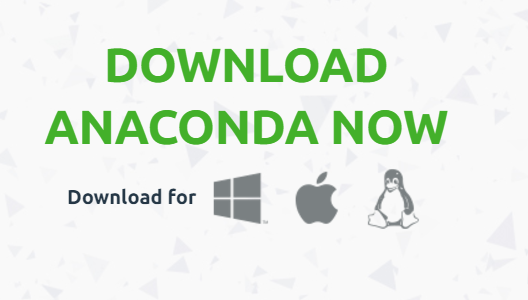
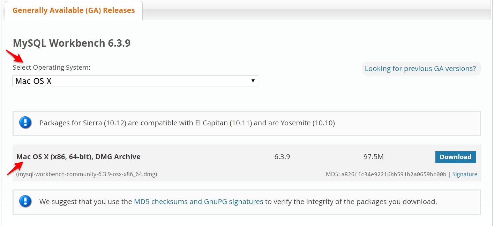
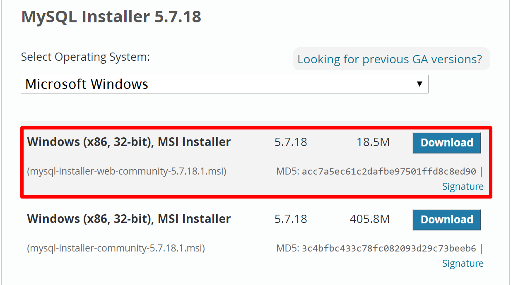
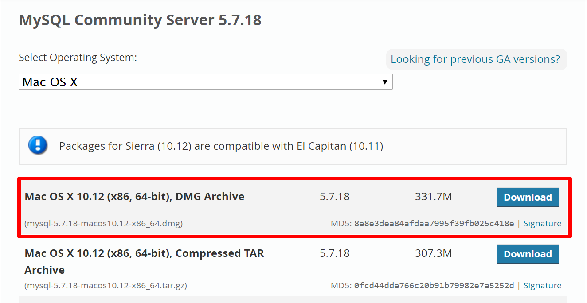

# Getting Started

:+1::tada: First off—welcome to the course! :tada::+1:

This document will guide you through the installation of the main software you'll use throughout the term, and provide context on where and why we use each one. These are:

1. [Microsoft Excel](#excel)
2. [Python & Anaconda](#anaconda)
3. [MySQL](#mysql)
4. [MongoDB](#mongodb)
5. [VS Code](#vscode)

To ensure you always have the most up-to-date instructions, we'll defer to the preexisting guides put together by maintainers of each project wherever possible.

Let's get started!

##  Microsoft Excel

You'll be learning the ins and outs of [Microsoft Excel](https://products.office.com/en-us/excel) in the first few weeks of the course. You can get Excel on a subscription basis, via Office 365, or as a one-time puchase. Details on both options are available at the [Microsoft Store](https://products.office.com/en-us/buy/compare-microsoft-office-products?tab=omac). Be sure to select the correct operating system before purchase.

Once you've paid and downloaded the software, you'll be prompted with the latest installation instructions for your platform. Simply follow them, and confirm your installation after by opening Excel!

##  Python & Anaconda

Python and its ecosystem are extremely popular tools in the world of data analysis. This course will use a popular all-in-one solution, called [Anaconda](https://www.anaconda.com), which contains everything we'll need for the Python units of the course.

Head to the [Anaconda Download Page](https://www.continuum.io/DOWNLOADS), and click on the logo for your operating system to download the appropriate installer. Then, simply open the installer and follow the on-screen instructions. If you run into complications, the [detailed installation guide](https://docs.continuum.io/anaconda/install) will walk you through the process step-by-step.

##  MySQL & MySQL Workbench

Roughly halfway through the course, we'll learn about databases. We'll be using MySQL for these units, as it's both freely available, and one of the world's most popular database solutions,

Installing MySQL is as simple as downloading and running the appropriate installer. See the links below for instructions specific to your platform.

In addition to MySQL, we will need to install a tool, called MySQL workbench, that makes working with it a bit easier. Visit the [MySQL workbench download page](https://dev.mysql.com/downloads/workbench/). Scroll to the bottom, select your operating system in the form, and then download and run the installer.

### Installing MySQL on Windows

Visit the [MySQL installer downloads page](https://dev.mysql.com/downloads/installer/). Scroll to the bottom to find the installer downloads.

There are two options—one for installing while online, and one for installing while offline. We recommend downloading the former, called the **web community** installer, as it's a smaller file to download. This is typically the top file.

Once you've downloaded the installer, simply follow the instructions to install MySQL.

During the installation, you will be prompted to create a password. **Be absolutely sure to record this password**—it's essential for working through the MySQL lessons.

### Installing MySQL on OS X

First, [visit the MySQL downloads page](https://dev.mysql.com/downloads/mysql/). Then, scroll to the bottom; select **Mac OS X** as your operating system; download the DMG—_not_ the TAR archives—and follow the [Mac OS X installation instructions](https://dev.mysql.com/downloads/mysql/).

During the installation, you will be prompted to create a password. **Be absolutely sure to record this password**—it's essential for working through the MySQL lessons.

##  MongoDB

Like MySQL, MongoDB is a database. But, it works in a fundamentally different way, and has certain advantages and disadvantages as compared to MySQL. We'll use it during the web portion of the course.

Since installing MongoDB is somewhat involved and we won't be using MongoDB until rather late in the course, it's not necessary to have it installed on Day 1—there will be time later for us to set it up together.

However, if you'd like to get a head start, [installation instructions for Windows user are here](https://docs.mongodb.com/manual/tutorial/install-mongodb-on-windows/#get-mongodb-community-edition), and [installation instructions for OS X  are here](https://docs.mongodb.com/manual/tutorial/install-mongodb-on-os-x/#install-mongodb-community-edition).

##  VS Code

A dedicated text editor is a central piece of any data analyst's toolkit.

For this course, we'll use [VS Code](https://code.visualstudio.com/). Simply visit the home page, click the download button, and run the installer once the download finishes.

- - -

### Copyright

Trilogy Education Services © 2017. All Rights Reserved.
